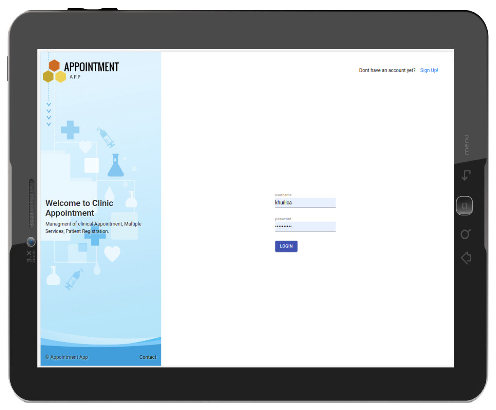
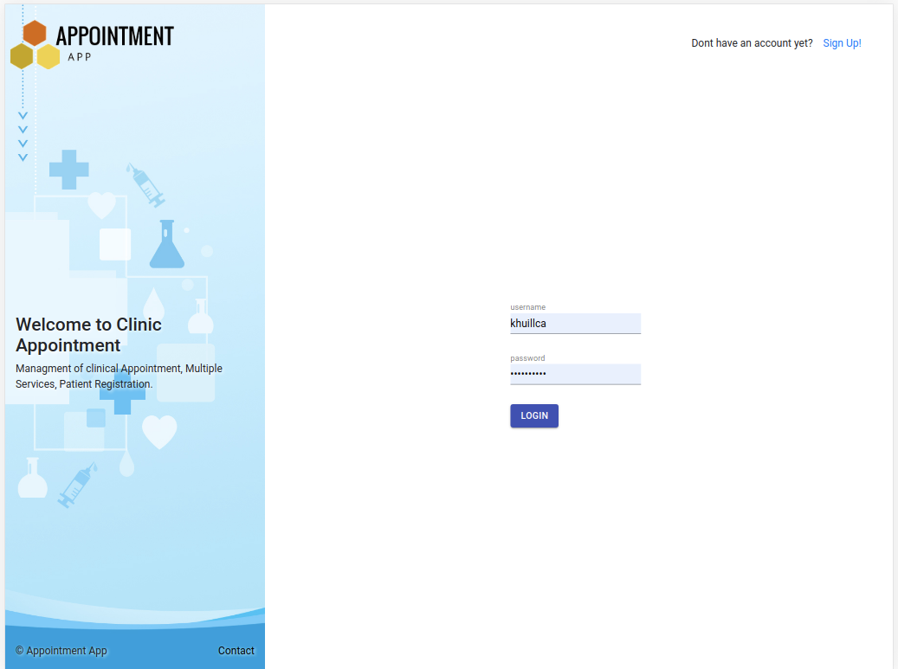
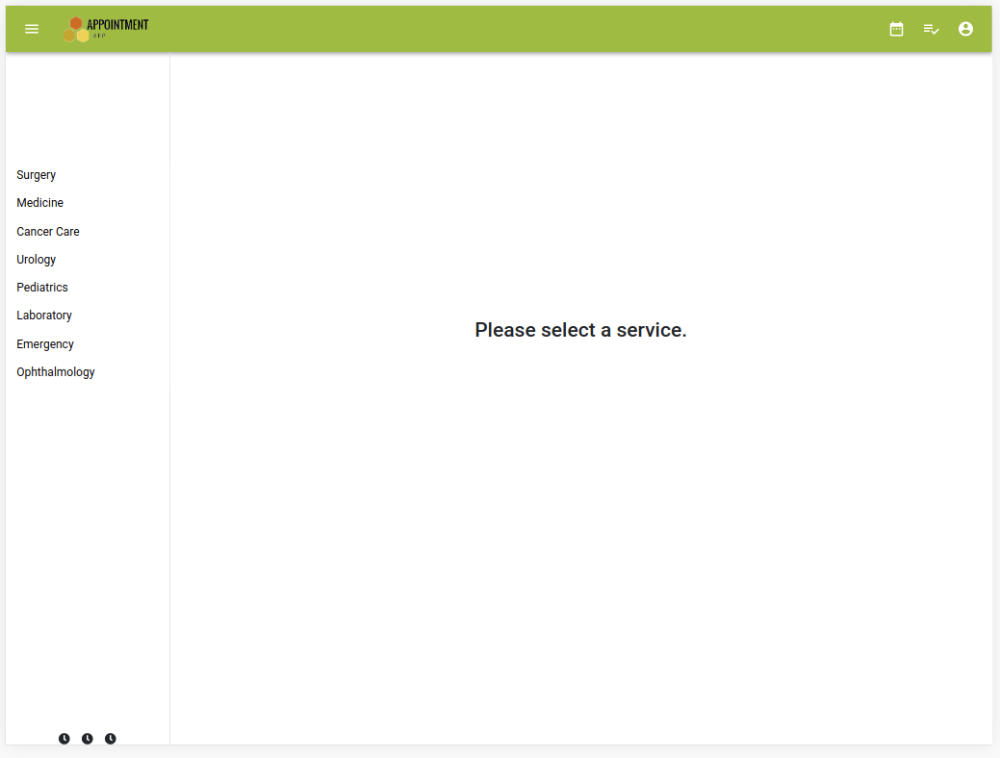
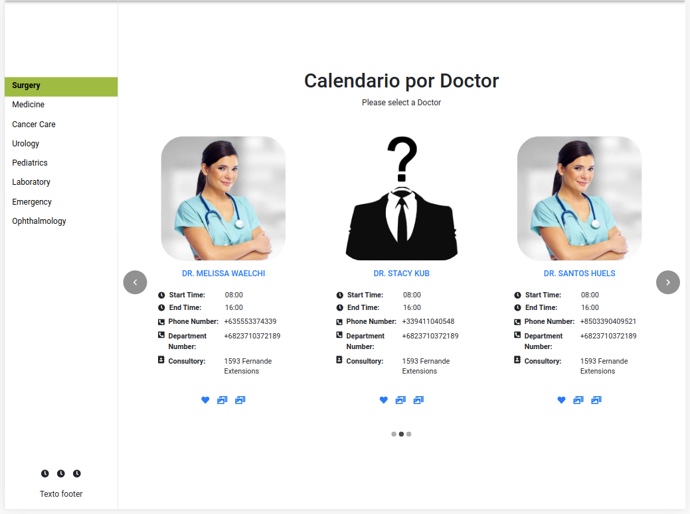
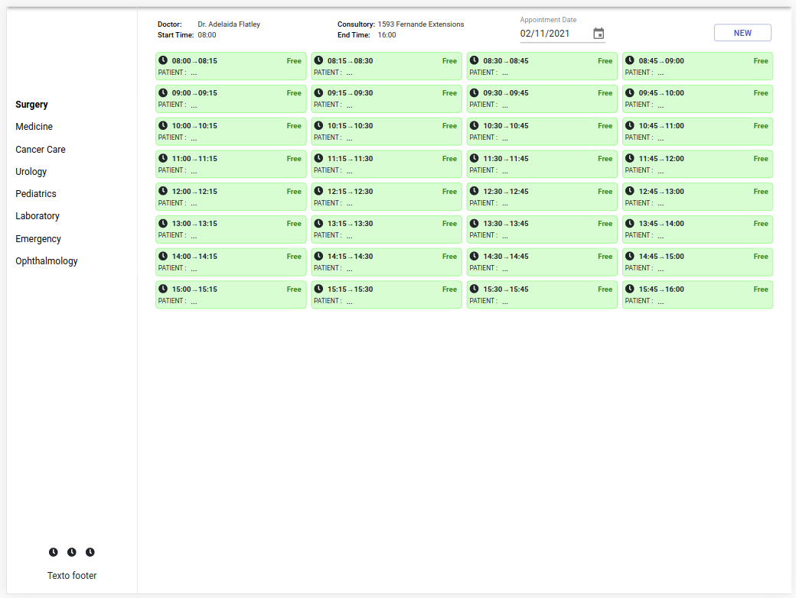
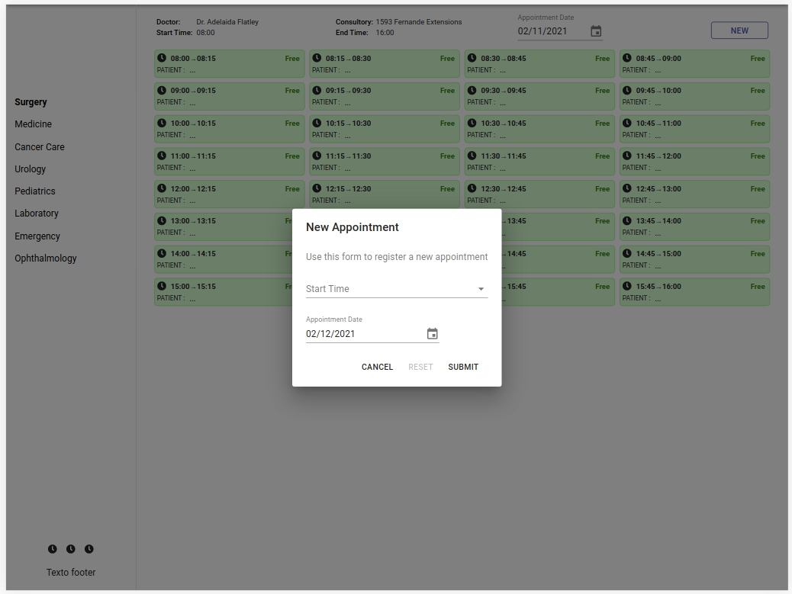

<p align="center">
    
</p>

<p align="center">
    <h1 align="center"> SISTEMA DE GESTION DE CITAS DE UN HOSPITAL  </h1>    
</p>

<p align="center">
    <h2 align="center"> Aplicacion Web & Version para tablets parael manejo de citas de un hospital </h2>    
</p>
<br />


 


<br/>


Hospital Appointment System es una versión para tableta de la aplicación web, esta aplicación fue construida con ROR y <strong>React & Redux</strong> la última versión, incluye la capacidad de registrar nuevos usuarios, iniciar sesión en la aplicación creando una sesión de token, cuando están logueados en la aplicación podemos seleccionar un servicio (Cirugía, Medicina y otros), cada una de las opciones muestra diferentes médicos y su disponibilidad de atención, finalmente podemos crear una cita para una fecha y servicio específico.<br/>

### Principales características
- Crear un nuevo usuario
- Iniciar sesión con generación de token
- Mostrar una lista de servicios como un menú
- Mostrar lista de carrusel de médicos para cada servicio
- Mostrar disponibilidad para cada médico
- Crear nueva cita
- Lista de cita por paciente


<br/>

##Empezando

Este proyecto se creó utilizando React y Redux, Nodejs y Express Con lambda functions e integracion a apigateway de amazon web service de arquitectura, es una aplicación web y para ejecutarse en su entorno local debe seguir estas pautas.
<br/>
<br/>
**THIS IS THE FRONTEND OF THE APPLICATION AND THE BACKEND IS LOCATED IN THIS LINK** [(backend)](https://github.com/rubenpazch/entAPI)
<br/>

### Pre-requisitos

- Nodejs
- React & Redux
- Git
- React Testing Library
- CSS modules 
- React Hooks
- Styled components
- Axios
-fetch
-aws Lambda functions
-api gateway TIPO REST


### Setup

The project repository can be found in [GitHub link](https://github.com/rubenpazch/appointment-view/tree/list) or just clone the project using this command. 


```
Using SSH 

# git clone  git@github.com:rubenpazch/appointment-view.git

Using HTTPS

# git clone  https://github.com/rubenpazch/appointment-view.git

```

+ Open terminal on your workspace with

```
cd /home/workspace/appointment-view
```


## Install


To get started with the app, clone the repo, and then install the needed packages using yarn or npm:

```
# npm install or yarn install
```

to start the local application run:

```
# npm start
```


### Usage

To watch the local version of this project check on your browser for the link 

```
Listening on tcp://127.0.0.1:3000
```

### Run tests

Run the test suite to verify that everything is working correctly:

```
# npm test

```

If the test suite passes, you'll be ready to run the app in a local server:


### Deployment

To deploy to netlify just push your changes and create a new project inside netlify, the link your account with github, remenber that you can use 

<b>npm run build or yarn build</b>


## Optional Features

+ For this project it was 
+ stylelint
+ React Testing Library
+ CSS modules 
+ React Hooks

<br/>

## Watch the Live Version

<br/>

click on the link to watch [live version](https://agile-lowlands-59460.herokuapp.com/)

<br/>

click on the link to watch project description [video 1](https://www.notion.so/Final-Capstone-Project-Book-an-Appointment-41ded2ee99ff4fe4becf91acb332ca26)


<br/>


## Screenshots of the App



<br/>

<br/>

<br/>

<br/>



## Contributing

This project was created for educational purposes as part of the Microverse web development curriculum; contributing is not accepted.

Feel free to check the [issues page](https://github.com/rubenpazch/catalogue-of-dog-clothes/issues).


## Authors

👤 **Ruben Paz Chuspe**

- Github: [@rubenpazch](https://github.com/rubenpazch)
- Linkedin: [rubenpch](https://www.linkedin.com/in/rubenpch/)
- Twitter: [@ChuspePaz](https://twitter.com/ChuspePaz)

### Show your support

Give a ⭐️ if you like this project!


## License

This project is licensed under the MIT License - see the [LICENSE.md](LICENSE.md) file for details

## Acknowledgments

* [Creative Commons ](https://creativecommons.org/licenses/by-nc/4.0/)

* [behance.net ](https://www.behance.net/gallery/24531031/Pimp-my-DOG-Online-store-E-commerse-project)
